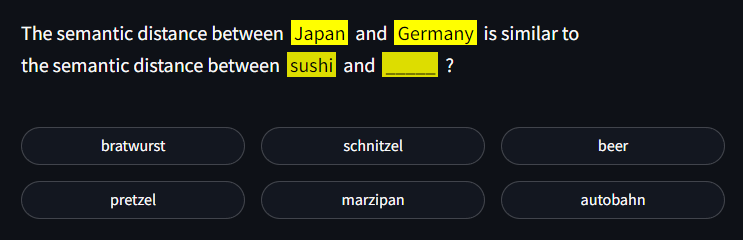
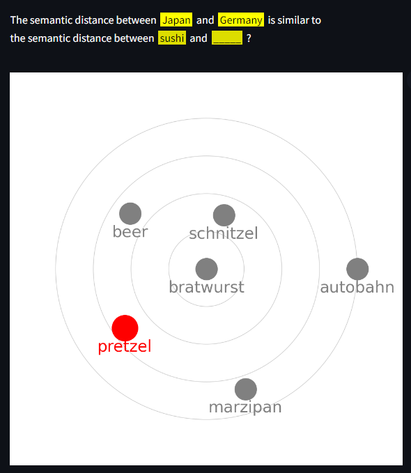

# Semantic Spaces

Dive into the depths of semantic pathways as perceived by cutting-edge AI.

## Online version

https://semantic-spaces.onrender.com/.

Please allow for 50 seconds loading time (the downside of using a free hosting service).

## Screenshots

### Puzzle and options

### Results

## Getting started

### Prerequisite

- Python 3.6 or newer

### Installation

Clone the repo

    git clone https://github.com/OdinMB/semantic-spaces-game.git

Navigate to the game's directory:

    cd semantic-spaces-game

Install the required Python packages:

    pip install -r requirements.txt

Launch the game

    streamlit run Game.py

## Creating new riddles

### Convention

Riddles are stored in the `riddles.txt` file, with one riddle in each line. For semantic pathway riddles, the first three terms of each line are the ones showing up in the riddle statement. The six following ones are the options that the player can choose from. Terms are separated by ';'.

"**Japan** is to **Germany** as **sushi** is to **\_\_\_\_\_**" is stored like this:

    Japan;Germany;sushi;bratwurst;schnitzel;beer;pretzel;marzipan;autobahn

For semantic distance riddles, leave the first two terms empty.

"**Lame vacation** is semantically closest to **\_\_\_\_\_**" is stored like this:

    ;;lame vacation;guided bus tour;cruise ship vacation;etc.

### Process

**Set up creation mode** (once)

1. Create a `.env` file with this entry: `OPENAI_API_KEY=your-api-key`.
2. Create a `riddles_wip.txt` file.

**Activate creation mode**

If the `riddles_wip.txt` file exists and is not empty, you have entered riddle creation mode. The game and `python create_embeddings_openai.py` will use this file over the default `riddles.txt` file.

**Add a new riddle**

3. Enter a riddle into the `riddles_wip.txt` file using the structure summarized above.
4. Run `python create_embeddings_openai.py` to generate a `riddles_wip.npy` file which stores the embeddings for the terms that you included in your riddle (using `text-embedding-ada-002`).
5. Run the game to test your riddle.
6. Repeat steps 3-5 until you're happy with the result.
7. Copy the new riddle from `riddles_wip.txt` to `riddles.txt`.

**Wrap-up creation mode**

8. Delete all content from the `riddles_wip.txt` file (or delete the file). This brings you back to game mode.
9. Run `python create_embeddings_openai.py` to update the `riddles.npy` file with the embeddings for the newly added riddles.

## Deployment

Streamlit needs to be deployed in headless mode. Do one of these:

- Set environment variable `STREAMLIT_SERVER_HEADLESS=true`
- Use a parameter in the start command `streamlit run Game.py --server.headless true`

## License

"Semantic Spaces" by Odin Mühlenbein is published under a CC-BY 4.0 license.
